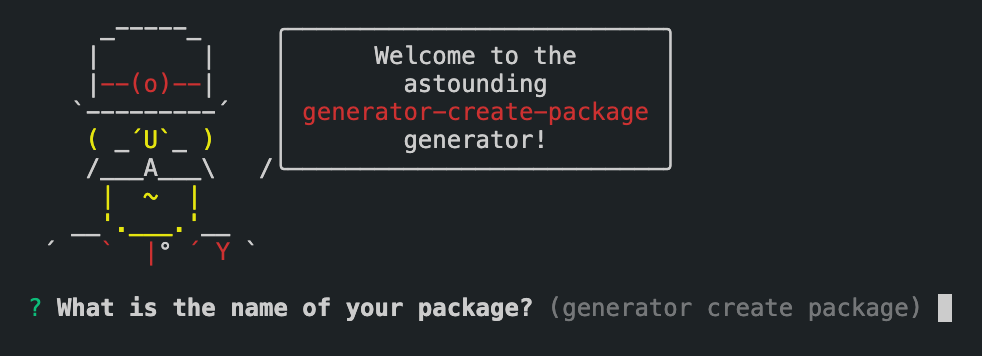

<div align="center">
  <h1>create-package</h1>
  <p>Boring TypeScript Package Generator</p>

  <p>
    <a href="https://github.com/boringcodes/create-package/commits" aria-label="Commitizen Friendly">
      
    </a>
    <a href="https://github.com/boringcodes/create-package" aria-label="Prettier Code Style">
      
    </a>
    <a href="https://github.com/boringcodes/create-package/actions" aria-label="GitHub Workflow Status">
      
    </a>
    <a href="https://david-dm.org/boringcodes/create-package" aria-label="Dependencies Status">
      
    </a>
    <a href="https://www.npmjs.com/package/generator-create-package" aria-label="NPM Version">
      
    </a>
    <a href="https://www.npmjs.com/package/generator-create-package" aria-label="NPM Downloads">
      
    </a>
    <a href="https://github.com/boringcodes/create-package/blob/master/LICENSE" aria-label="MIT License">
      
    </a>
    <a href="https://github.com/boringcodes" aria-label="BoringCodes Verified">
      
    </a>
  </p>

  
</div>

## Features

- [x] Rollupjs packaging system with TypeScript by default
- [ ] Prettier
- [x] TsLint
- [x] Husky
- [x] Conventional release by **standard-version**
- [x] GitHub actions (build, create github release, publish to npm)

## Installation

Make sure `yeoman` is installed

```sh
$ yarn global add yo
```

Then install the generator

```sh
$ yarn global add generator-create-package
```

## Usage

Create a new directory

```sh
$ mkdir package-name
```

Then navigate to the created directory and run the following command to generate source

```sh
$ yo create-package
```

This scaffolds out:

```
├── src
│   ├── index.ts
├── .huskyrc
├── package.json
├── rollup.config.js
├── tsconfig.json
└── tslint.json
```

## Contributing

Pull requests are welcome. For major changes, please open an issue first to discuss what you would like to change.

Please make sure to update tests as appropriate.

## Authors

[BoringCodes](https://github.com/boringcodes)

## License

[MIT](https://github.com/boringcodes/create-package/blob/master/LICENSE)
